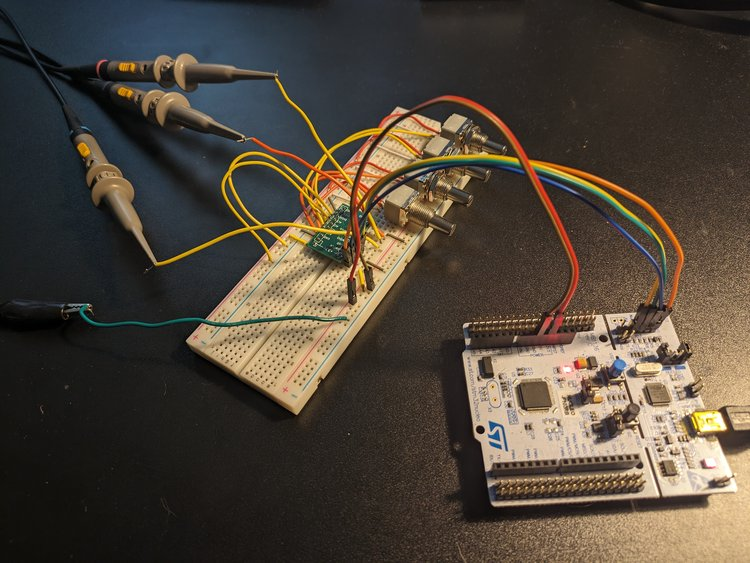

# STM32CubeIDE "Hello World" example

## Brief
- This example is intended to exercise all of the IO pins on the board to verify everything works
- It is not intended as a real world project that does anything useful
- It does serve as an example of how to read and write analog and digital signals and write to the DAC
- It's an STM32CubeIDE project

## Description
This demo writes two low frequency analog ramp signals via the MCP4822 2-channel DAC.

Each ramp has:
- Variable frequency controlled by an analog signal in [0v, +3.3v]
- Variable offset controlled by an analog signal in [0v, +3.3v]
- The ability to "freeze" the ramp with a digital pin
  - Low = free running, high = frozen (the ramp stays at its current value until unfrozen)

The analog input signals can be driven by potentiometers wired as voltage dividers across the +3v3 rail, or any other convenient CV source that is in [0v, +3.3v].

## Pinouts

| PCB pin (silkscreen) | STM32 pin | Function |
|---|---|---|
| AI0 | PA0 | Rate A CV |
| AI1 | PA1 | Offset A CV |
| AI2 | PA2 | Rate B CV |
| AI3 | PA3 | Offset B CV |
| DOI0 | PA10 | Freeze A |
| DIO1 | PA9 | Freeze B |
| DIO2 | PA6 | CLK out (*f* = sample-rate / 2) |
| AO0 | - | Ramp A out, MCP4822 channel A |
| AO1 | - | Ramp B out, MCP4822 channel B |

### Schematic view of connections


### STM32CubeIDE view of connections


### Example breadboard setup


## To verify
- Connect up the board as shown above, using a breadboard or other convenient method
- Flash the STM32L0 microcontroller with an STlink using the SWCLK and SWDIO pins
- Monitor the AO0, AO1, and DIO2 pins with an oscilloscope
- Verify that twiddling the pots alters the frequency and offset of the ramp signals
- Verify that pulling the FREEZE pins high freezes the associated ramp, and that the ramp resumes when the FREEZE pin is pulled low again 
- Verify that the CLK out on DIO2 is a square wave at 500Hz (default value)

Note that in the breadboard setup shown above, I am powering the board under test with a Nucleo acting as an STLink. This can be a convenient way to set up a minimal test.

Also note that I'm just using jumper wires jammed into the breadboard as the FREEZE switches.

## STM32CubeIDE Project Structure
This is a C++ CubeIDE project. The simplified project tree is shown below:

```
.
├── app
│   ├── app_main.cpp
│   └── app_main.hpp
├── lib
│   ├── analog_signals.cpp
│   ├── analog_signals.hpp
│   ├── MCP4822.cpp
│   └── MCP4822.hpp
├── Core
│   └── STM32 autogenerated Core .h and .c files
├── Drivers
│   └── STM32 provided CMSIS and driver files
├── L031F4Px_hello_world_example.ioc
└── STM32L031F4PX_FLASH.ld
```
User code is placed in `app` and `lib`. The `lib` directory contains user library files, `app` contains the main user application entry point. You shouldn't need to touch anything in `Core/` or `Drivers/` unless you want to change the pin or clock configuration.

The main application entry point function `app_main()` is called by the autogenerated `main()` function defined in `Core/Src/main.c` before the `while(1)` loop starts.

This allows us to keep our main application code separate from the CubeIDE autogenerated code. In my opinion this is cleaner than placing user code in the user-code-guards in the STM32 generated files.

### DMA note
The potentiometers are continuously read by the ADC and stored in a buffer via DMA. There are other ways to read the pots, this is one example of how you can scan a few pots.